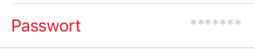

# 安裝失敗！

太神奇了。你明明照著規矩寫，甚至跟其他專案無異，為什麼還無法正常啟動？

本篇或許可以給你一些指引。

## 缺乏 Launcher Activity

這可能是最常見的錯誤─至少我目前為止遭遇的安裝失敗都跟這個有關。

有些（試題）專案可能一開始沒有提供 Launcher Activity, 需要你自行新增。

此時你可能會發生以下錯誤：

```
Could not get package user id: run-as: unknown package: *********
Could not find apks for this package:*********
Failed to measure fs-verity, errno 1: /data/app/~~5ti6AseQG8s1ekU9IN_oiA==/*********-iDGSJQ8EUBgzZYNGhBBuzw==/base.apk
Could not remove dir '/data/data/*********/code_cache/.ll/': No such file or directory
```

此問題在 Android Studio Dolphin 版本後變得常發生：

1. [https://issuetracker.google.com/issues/248916538](https://issuetracker.google.com/issues/248916538)
2. [https://issuetracker.google.com/issues/250422176](https://issuetracker.google.com/issues/250422176)

### 解決方法

1. 設置 Launcher Activity
2. 參照下方 SOF **設置 App Configuration （重要！！！）**



<figure><figcaption></figcaption></figure>


<figure><figcaption></figcaption></figure>


